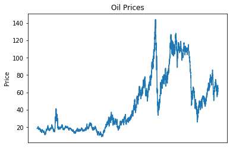
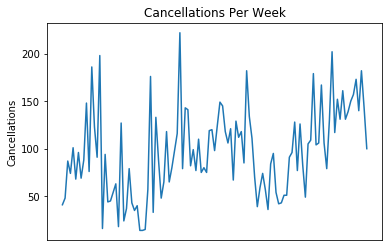

# Using LSTM Networks To Forecast Oil Prices

There has been much speculation as to whether models such as LSTM can be used to forecast asset prices - in this example, oil.

In reality, trying to forecast asset prices using machine learning models can often be a futile exercise - asset prices constantly fluctuate based on trading activity, and any advantage yielded by a predictive method would quickly be eroded as the market becomes more efficient over time. This is particularly true when dealing with short-term fluctuations in the market - which is subject to a high degree of automated trading by highly sophisticated financial institutions.

However, that is not to say that models such as LSTM cannot be of some value in forecasting a time series over a longer-term period, including that of asset prices.

In this regard, an LSTM model is built to forecast oil price fluctuations, with the dataset encompassing the time period May 1987 - September 2019. The [Brent Oil prices dataset](https://www.kaggle.com/mabusalah/brent-oil-prices/data) is sourced from Kaggle.

## Time Series

When analysing the time series, the first noticeable feature is that a strong upward trend is present in the data:



This is in contrast to a time series with a more stationary shape, such as the [weekly hotel cancellation time series](https://www.michael-grogan.com/hotel-cancellations-lstm/) featured in one of my other articles.



As a result, the former might prove to be a more difficult dataset to predict - given that a time series relies on stationarity (or a similar pattern across the training and test set) in order to make accurate forecasts.

To smooth out the volatility in the dataset, the natural log of the oil price is calculated.

```
>>> result = adfuller(tsdiff)
>>> print('ADF Statistic: %f' % result[0])
>>> print('p-value: %f' % result[1])
>>> print('Critical Values:')
>>> for key, value in result[4].items():
>>>     print('\t%s: %.3f' % (key, value))

ADF Statistic: -1.613410
p-value: 0.476186
Critical Values:
	1%: -3.431
	5%: -2.862
	10%: -2.567
```
