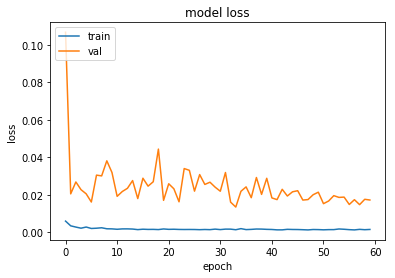
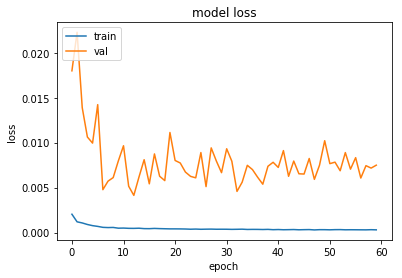
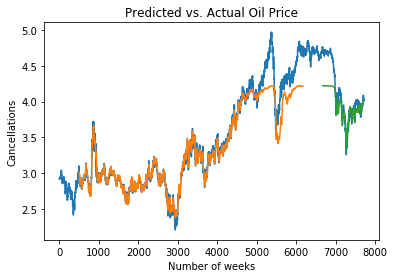
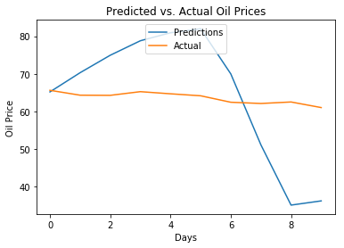
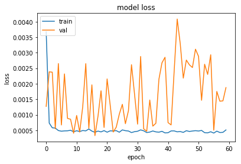
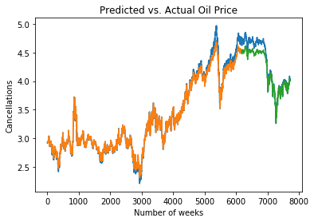
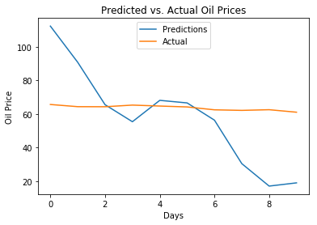

# Are LSTMs Always Effective At Time Series Analysis? A Case Study of Oil Prices

There has been much speculation as to whether models such as LSTM can be used to forecast asset prices - in this example, oil.

In reality, trying to forecast asset prices using machine learning models can often be a futile exercise - asset prices constantly fluctuate based on trading activity, and any advantage yielded by a predictive method would quickly be eroded as the market becomes more efficient over time. This is particularly true when dealing with short-term fluctuations in the market - which is subject to a high degree of automated trading by highly sophisticated financial institutions.

However, that is not to say that models such as LSTM cannot be of some value in forecasting a time series over a longer-term period, including that of asset prices.

In this regard, an LSTM model is built to forecast oil price fluctuations, with the dataset encompassing the time period May 1987 - September 2019. The [Brent Oil prices dataset](https://www.kaggle.com/mabusalah/brent-oil-prices/data) is sourced from Kaggle.

## Time Series

When analysing the time series, the first noticeable feature is that a strong upward trend is present in the data:


This is in contrast to a time series with a more stationary shape, such as the [weekly hotel cancellation time series](https://www.michael-grogan.com/hotel-cancellations-lstm/) featured in one of my other articles.


As a result, the former might prove to be a more difficult dataset to predict - given that a time series relies on stationarity (or a similar pattern across the training and test set) in order to make accurate forecasts.

To smooth out the volatility in the dataset, the natural log of the oil price is calculated.

```
In [9]:

from statsmodels.tsa.stattools import adfuller
result = adfuller(tseries)
print('ADF Statistic: %f' % result[0])
print('p-value: %f' % result[1])
print('Critical Values:')
for key, value in result[4].items():
    print('\t%s: %.3f' % (key, value))

Out [9]:

ADF Statistic: -1.954749
p-value: 0.306759
Critical Values:
	1%: -3.431
	5%: -2.862
	10%: -2.567
```

As can be seen, the p-value for the Dickey-Fuller test is significantly above 0.05, which indicates that a unit root is present and therefore non-stationarity is likely to be present in the model.

While the time series should ordinarily be transformed into a stationary one for forecasting, it is assumed for this purpose that the LSTM model will be more adept at [learning nonlinearities](https://datascience.stackexchange.com/questions/24800/time-series-prediction-using-lstms-importance-of-making-time-series-stationary) than a model such as ARIMA. In this regard, forecasts are made on the time series "as is".

## Data Processing

To process the time series, a dataset matrix is formed:

```
In [14]:

# Form dataset matrix
def create_dataset(df, previous=1):
    dataX, dataY = [], []
    for i in range(len(df)-previous-1):
        a = df[i:(i+previous), 0]
        dataX.append(a)
        dataY.append(df[i + previous, 0])
    return np.array(dataX), np.array(dataY)

In [15]:

df=np.array(df)

In [16]:

df

Out[16]:

array([[2.92477318],
       [2.91506437],
       [2.92046979],
       ...,
       [4.12842388],
       [4.13484651],
       [4.11070992]])
```

Then, the dataset is normalized using **MinMaxScaler**:

```
In [17]:

# normalize dataset with MinMaxScaler
scaler = MinMaxScaler(feature_range=(0, 1))
df = scaler.fit_transform(df)
df

Out[17]:

array([[0.25948897],
       [0.2559728 ],
       [0.25793044],
       ...,
       [0.69540609],
       [0.69773213],
       [0.68899076]])
```

The training and validation datasets are then created. In order to capture longer-term dependencies, **500** is set as the parameter for the **previous** variable, i.e. the number of previous time intervals that are used to predict the oil price at time *t*.

```
In [18]:

import tensorflow as tf
from tensorflow.keras import layers
from tensorflow.keras.layers import Dense
from tensorflow.keras.layers import LSTM

# Training and Validation data partition
train_size = int(len(df) * 0.8)
val_size = len(df) - train_size
train, val = df[0:train_size,:], df[train_size:len(df),:]

# Number of previous
previous = 500
X_train, Y_train = create_dataset(train, previous)
X_val, Y_val = create_dataset(val, previous)

In [19]:

X_train

Out[19]:

array([[0.25948897, 0.2559728 , 0.25793044, ..., 0.26945914, 0.26431659,
        0.2797141 ],
       [0.2559728 , 0.25793044, 0.25890531, ..., 0.26431659, 0.2797141 ,
        0.27415651],
       [0.25793044, 0.25890531, 0.25948897, ..., 0.2797141 , 0.27415651,
        0.26277874],
       ...,
       [0.94306793, 0.94274392, 0.95262698, ..., 0.87933295, 0.88254847,
        0.88504519],
       [0.94274392, 0.95262698, 0.95308549, ..., 0.88254847, 0.88504519,
        0.88094428],
       [0.95262698, 0.95308549, 0.93808763, ..., 0.88504519, 0.88094428,
        0.87016019]])

In [20]:

Y_train

Out[20]:

array([0.27415651, 0.26277874, 0.26718257, ..., 0.88094428, 0.87016019,
       0.8655946 ])
```

## LSTM Model

For the final model, **60** epochs are used for training with one hidden layer, with a dropout rate of **0.05**. Dropout is a [regularization method](https://machinelearningmastery.com/use-dropout-lstm-networks-time-series-forecasting/) used to prevent overfitting, through excluding input and recurrent connections from weight updates when training the network, in order to allow an improvement in model performance. The **mean_squared_error** is used as the loss function.

```
In [21]:

from tensorflow.keras.layers import Dropout

# reshape input to be [samples, time steps, features]
X_train = np.reshape(X_train, (X_train.shape[0], 1, X_train.shape[1]))
X_val = np.reshape(X_val, (X_val.shape[0], 1, X_val.shape[1]))

# Generate LSTM network
model = tf.keras.Sequential()
model.add(LSTM(4, input_shape=(1, previous)))
model.add(Dropout(0.05))
model.add(Dense(1))
model.compile(loss='mean_squared_error', optimizer='adam')
history=model.fit(X_train, Y_train, validation_split=0.2, epochs=60, batch_size=1, verbose=2)

# list all data in history
print(history.history.keys())
# summarize history for accuracy
plt.plot(history.history['loss'])
plt.plot(history.history['val_loss'])
plt.title('model loss')
plt.ylabel('loss')
plt.xlabel('epoch')
plt.legend(['train', 'val'], loc='upper left')
plt.show()
```



When experimenting with LSTM, the model was initially run without dropout.



The mean directional accuracy (MDA), root mean squared error (RMSE) and mean forecast error (MFE) were computed when comparing the model predictions to the validation set.

| Reading      | No Dropout | Dropout = 0.05 |
| ----------- | ----------- | ----------- |
| MDA      | 0.99       | 0.99       |
| RMSE   | 0.2135        | 0.2487       |
| MFE   | 0.013        | -0.15        |

Based on the validation set, the results without Dropout performed the best.

Here are the predicted vs actual values for the training and validation sets:

**Without Dropout**


**With Dropout = 0.05**



**Predicted vs. Actual: Test (500 Days)**



## Test Set

In order to assess whether the model holds predictive power against completely unseen data - in this case the last 10 observations in the time series, the model was run once again by predicting the oil price at time *t* using the *t-500* previous observations.

Again, the model was run without Dropout and with Droput = 0.05, and here are the results:

| Reading      | No Dropout | Dropout = 0.05 |
| ----------- | ----------- | ----------- |
| MDA      | 0.8       | 0.8       |
| RMSE   | 28.27        | 15.71       |
| MFE   | 3.53        | 0.81        |

In this instance, using Dropout = 0.05 yielded better results.

Here is a plot of the predicted vs actual price. In both instances, we see that the predictions are significantly more volatile than the actual oil prices day-to-day - this is an indication that the model is inducing too much volatility into the predictions when using the 500-day period.

Therefore, it was chosen to use a 10-day period instead, using **Dropout = 0.05**.

Here are the results.

**Training vs. Validation Loss**



**Predicted vs. Actual: Training and Validation**



**Predicted vs. Actual: Test (10 Days)**



**Diagnostics**


| Reading      | Previous = 10 | Previous = 500 |
| ----------- | ----------- | ----------- |
| MDA      | 0.8 | 0.8 |
| RMSE   | 28.06 | 15.71 |
| MFE   | -5.52 | 0.81 |


When using a 10-day window instead of a 500-day window, we see that the results perform less well on RMSE and MFE.

However, in both cases, the predictions appear to be quite volatile relative to the actual values - this is an indication that LSTM is not necessarily the most ideal model for predicting data with a clear trend.

As a Sequential model, it is possible that LSTM simply carries too much volatility forward to the predictions, and in this regard LSTM is possibly more adept at forecasting a [series](https://www.michael-grogan.com/hotel-cancellations-lstm/) that has a more volatile nature.

## Conclusion

Using both the 10-day and 500-day window, the LSTM model was limited in being able to forecast oil prices - the main limitation being that LSTM tends to carry forward a high degree of volatility in predicting future values, and therefore may not be the best choice in modelling data with a strong trend.

The "no free lunch theorem" applies here - a model may work well in forecasting one type of data, but that does not mean it should be used in all cases.
